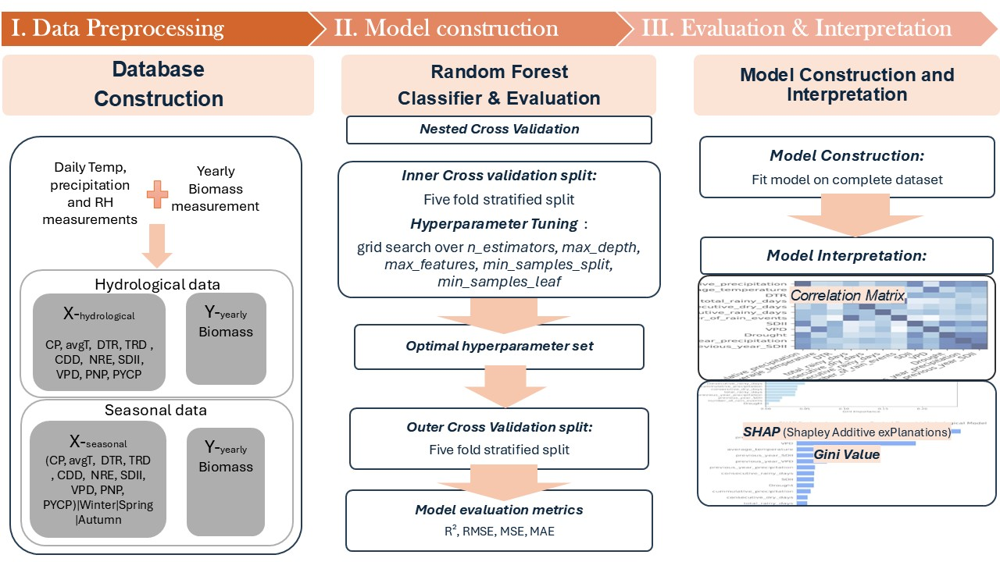
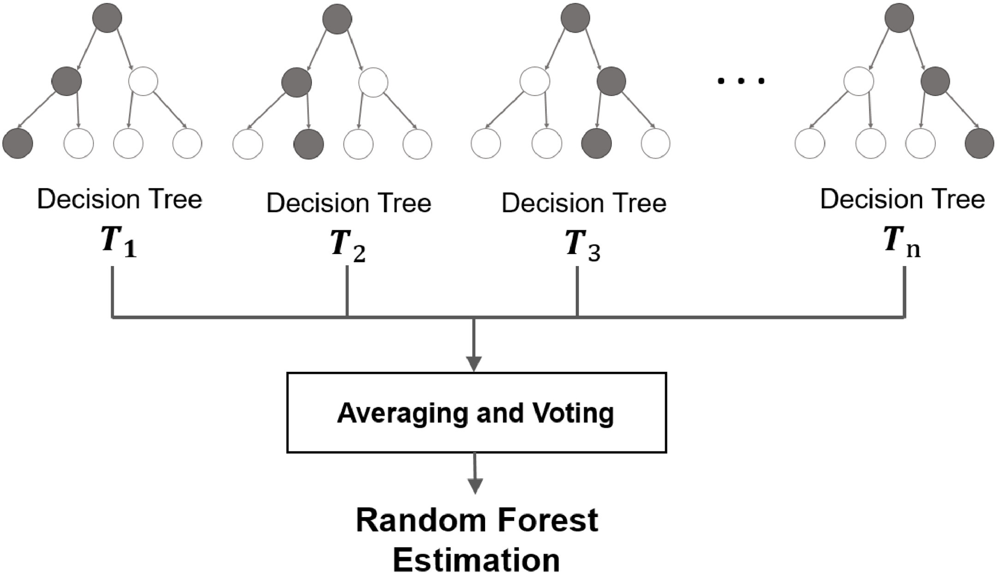
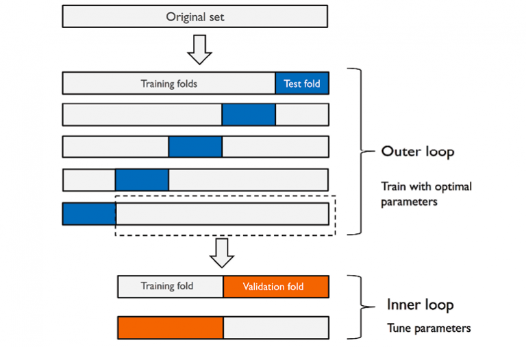
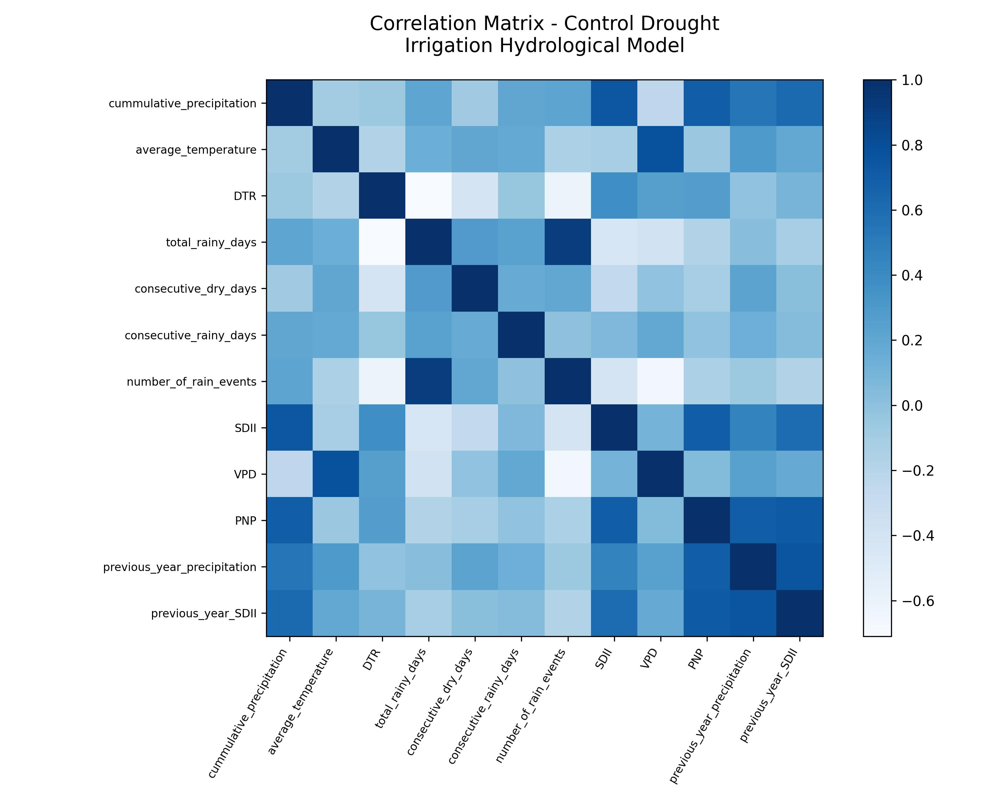
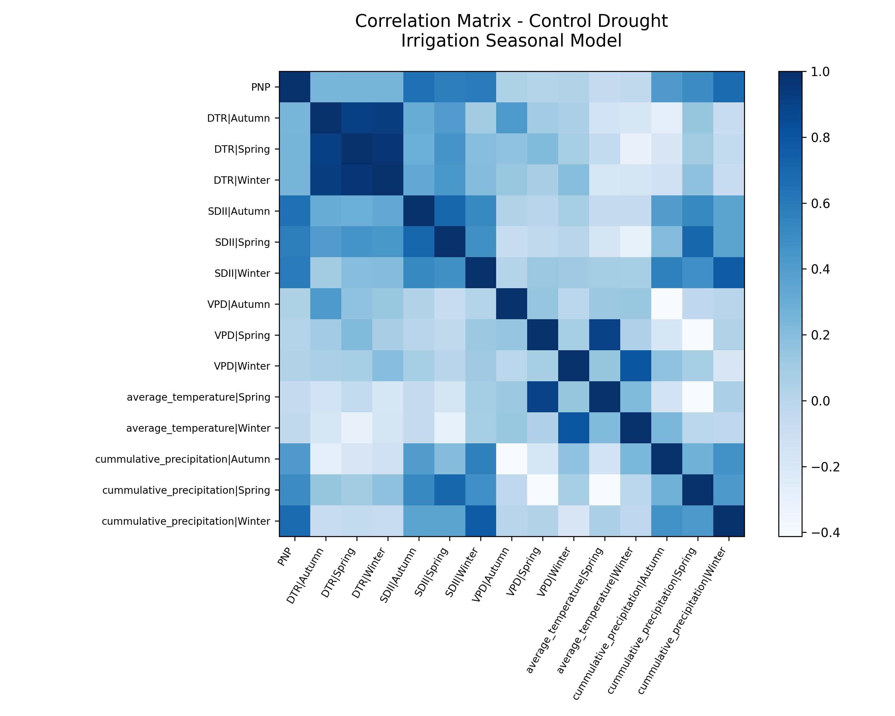
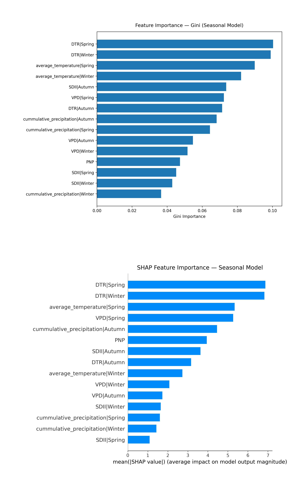
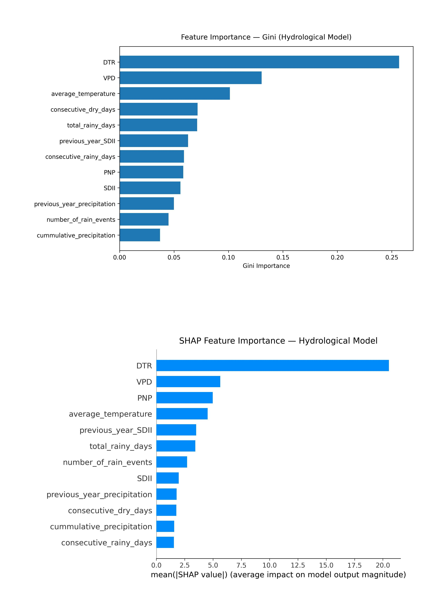
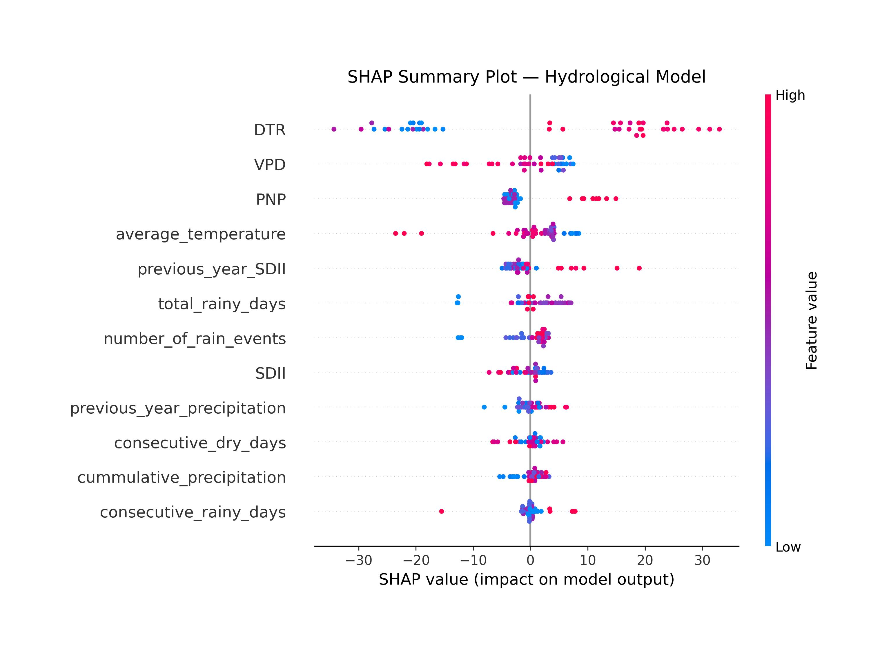
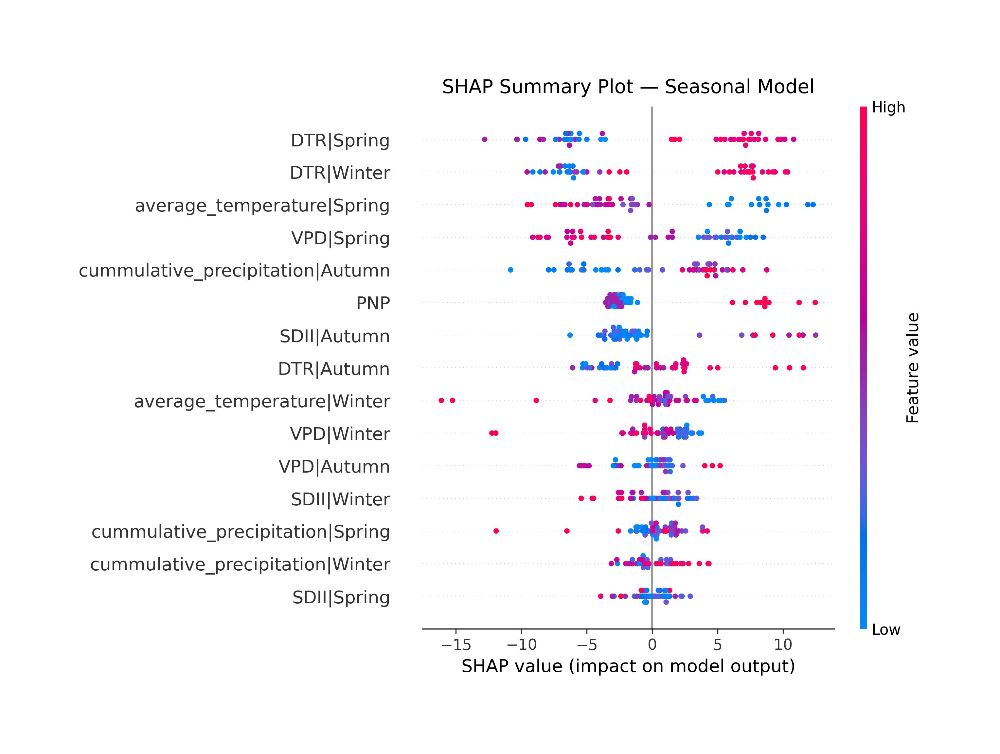
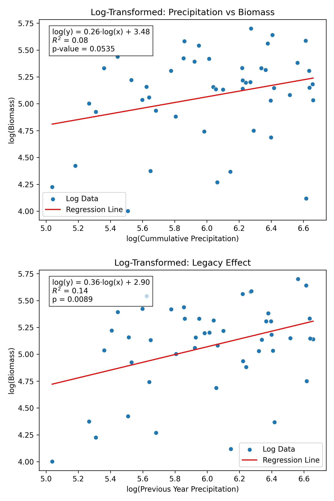

# 1. Introduction

## 1.1. Background
In the Mediterranean climate, plants have evolved under conditions of low soil-water and nutrient availabilities and have acquired a series of adaptive traits that, in turn exert strong feedback on soil fertility, structure, and protection. As a result, plant-soil systems constitute complex interactive webs where these adaptive traits allow plants to maximize the use of scarce resources.( Sardans et al. 2013) . The long-term evolutionary adaptation to drought of Mediterranean plants allows them to cope with moderate increases of drought without significant losses of production and survival in some species.  
Mediterranean-type climates are defined by temperate, wet winters, and warm or hot dry summers, winter storms bring precipitation and the summers are dry. (Seager et al. 2019)  
All Mediterranean Regions are overall semiarid as a result of the highly seasonal precipitation and long dry summers and all struggle with water resources at the best of times. Lying between the more arid subtropics and the more humid extratropics they are locations of impactful climate variability and are highly vulnerable to intense and protracted droughts (e.g., Hurrell 1995; Smith et al. 2000; Risbey et al. 2009; Seager et al. 2014a; Cook et al. 2016; Garreaud et al. 2017).  
The effects of climate change on Mediterranean ecosystems are profound and multifaceted, impacting soil moisture, pasture productivity  and biogeochemical cycles. These changes threaten the sustainability and functionality of these ecosystems, necessitating urgent attention and adaptive management strategies.  
Rising global temperatures have led to decreased soil moisture, particularly in Mediterranean regions, which is critical for crop growth and ecosystem stability (Huang et al. 2024). The reduction in soil moisture can lead to increased aridity, affecting plant health and agricultural productivity.  
Climate change is altering the productivity and nutritional quality of pastures in Mediterranean silvopastoral systems, with increased temperatures and reduced rainfall negatively impacting biomass and nutrient composition(Martins-Noguerol et al., 2023).  
Mediterranean forests are experiencing disruptions in carbon, nitrogen, and phosphorus cycles due to combined effects of drought and warming, leading to significant ecological consequences(Serrano et al. 2023). These changes can alter nutrient availability and soil organic matter, impacting overall ecosystem functioning.

### Projected changes:
The Mediterranean region is one of the most responsive areas to climate change and was identified as a major “hot-spot” based on global climate change analyses.  
The Mediterranean has long stood out in successive generations of global climate models (GCMs) as being particularly sensitive to rising concentrations of greenhouse gases. Models overwhelmingly project, across all scenarios, a large reduction in precipitation, more than in other land regions in relative terms (Fig. 1b) (Giorgi and Lionello 2008; Planton et al. 2012). A large part of that decline occurs during winter, with enhanced drying over northwestern Africa [from 230% to 240% in December–February (DJF) precipitation] and the eastern Mediterranean (from 220% to 225%). In summer, significant warming and drying is also projected for the northern Mediterranean (Brogli et al. 2019).  
All models predict a steady and significant warming across all study areas, accompanied by moderate changes in total annual precipitation, though with some seasonal variations. Future drought patterns in the Mediterranean region were analyzed based on the maximum duration of heat waves, their peak temperatures, and the number of consecutive dry days. The findings indicate an expected increase in both the duration and intensity of heat waves, as well as a rise in the maximum number of consecutive dry days across most study areas. (Valeria Todaro et al., 2022)  
The projected impacts of climate change pose significant risks to both societies and the environment in the Mediterranean region. A decline in future precipitation combined with increased evapotranspiration could easily trigger critical water shortages, especially in areas where water resources are already at precarious levels (Iglesias et al. 2007; García-Ruiz et al. 2011). Rising temperatures associated with climate change are expected to affect human health (Diffenbaugh et al. 2007), disrupt plant life cycles (Gordo and Sanz 2010), and elevate fire risk (Moriondo et al. 2006). Of particular concern are the consequences for agriculture, with studies highlighting potential reductions in crop yields and food security (Iglesias et al. 2011; Bindi and Olesen 2011; Tanasijevic et al. 2014; Saadi et al. 2015). In essence, climate change is likely to decrease the availability of crucial ecosystem services (Schröter et al. 2005).  
While the evidence highlights the severe impacts of climate change on Mediterranean ecosystems, it is also essential to consider the potential for adaptive management strategies that could mitigate these effects and promote ecosystem resilience. Understanding the nature and effect of Climate relations on mediterranean ecosystems is crucial in order to develop such strategies.

## 1.2. Random Forest and other ML Models:
Machine learning models are highly useful in understanding the effects of climate on biomass due to their ability to handle complex datasets, integrate diverse variables, and provide accurate predictions. These models can effectively analyze the intricate relationships between climate variables and biomass, offering insights that traditional methods may not capture.  
Machine learning models, such as random forests and support vector machines, can manage large datasets with numerous variables, including both biotic and abiotic factors, which are crucial for accurate biomass estimation( e.g: Huntington et al. 2020 , Liu et al. 2023 , Xiao He et al. 2022 ·)  
These models have demonstrated high accuracy in predicting biomass under various climate scenarios. For instance, random forest models have been used to predict sorghum yields and forest biomass with high precision, considering factors like greenhouse gas emissions and irrigation practices (e.g:  Huntington et al. 2020 , Xiao He et al. 2022, · Ghosh et al. 2018 )  
These characteristics make random forest regressors an excellent candidate for providing Insights into Climate-Biomass Relationships.  
This study aims to examine the effects of climate factors (temperature, rainfall patterns)  under the different drought treatments and categorize complex relations between climate factors on above-ground biomass in Mediterranean climate . More specifically, our study focuses on achieving the following objectives: (1) to utilize a random forest regressor model to predict above-ground biomass (2) to extract influental climate  factors and describe the nature of their influence.

# 2. Materials and Methods:

## 2.1. Research scope:
In this study, a RF regression model was developed to estimate the above ground biomass of in Mediterranean climate using various climate parameters as the model predictor. We performed a validation study of a biomass prediction model that estimates seasonal biomass response based on climatic conditions.  
The study procedure is shown in **Fig. 1**. First, the climate data was preprocessed to compute indices related to seasonal and interannual climate variability. Next, an RF algorithm was introduced for model building, and a grid search method was introduced to derive accurate model parameters. Data was partitioned using nested cross-validation, with 5 folds in the outer loop for model evaluation and 5 folds in the inner loop for hyperparameter optimization. Stratified splitting was performed  to maintain balanced distributions across folds.  The final step consisted of model evaluation. Performance evaluation was performed based on the coefficient of determination (R²), root mean squared error (RMSE), mean squared error (MSE), and mean absolute error (MAE), which were utilized to quantify the evaluation results. Finally, in the interpretation process, the concepts of SHAP and Gini importance were introduced to assess the relative contributions of the climate indices to biomass prediction.

**Figure 1. Model workflow. RH, relative humidity; CP, cumulative precipitation; avgT, yearly average temperature; DTR, daily temperature range (yearly average); TRD, total rainy days; CDD, consecutive dry days (yearly maximum); NRE, number of rain events; SDII, simple daily intensity index; VPD, vapor pressure deficit; PNP, percentage of Natural Precipitation; PYCP, previous year cumulative precipitation.**  

## 2.2. Study area

## 2.3. Data collection
The training data for model estimation were derived from long-term field experiments conducted at the Matta rainout-shelter site. All observations used in this study span 2002–2024. We selected this period to construct a dataset that combines continuous biomass measurements with consistent meteorological records and derived climate indices. Experimental units consisted of replicated plots subjected to drought treatments, and annual above-ground biomass was harvested each spring (April), oven-dried, and weighed to obtain the target variable for model estimation. Climate indices related to precipitation, temperature, humidity, and drought conditions were computed from daily meteorological observations and used as input variables.  
From 2002 to 2010, biomass was collected in 15 plots (5 per treatment) with 10 within-plot quadrat replications (20×20 cm). Treatments included irrigated (I; ~+33% of ambient precipitation), control (C; ambient precipitation), and drought (D; ~66% of ambient precipitation reaching the plot via shelter coverage). From 2011 to 2017, the experiment maintained the three treatments (I, C, D); annual data were available as plot/treatment means per year. From 2018 to 2024, the design employed 5 blocks × 4 plots per block (one treatment per plot; 5 replications per plot). During 2018–2021, the shelter scheme included D, D66-HF, D66-LF, and C; for model training, only the treatments consistent with the final design were retained. Beginning in 2021, all drought treatments followed the D66 protocol (≈33% of ambient precipitation; 66% rain exclusion). The final dataset pairs each biomass observation with climate indices from the preceding hydrological or seasonal windows, as described below.

### 2.3.1. Meteorological data and climate indices
Meteorological data were compiled from multiple sources to ensure coverage across the full study period. For 2021–2024, in-field measurements from the Matta station (Zentra Cloud) provided hourly temperature, precipitation, and humidity (used to compute VPD). Historical Matta records supplied daily precipitation and daily minimum/mean/maximum temperature for 2003–2014, with relative humidity available from 2011 onward. To bridge gaps from 2014–2021, daily observations were obtained from nearby stations (Rosh Tzurim and Tzur Hadassa). Station series were harmonized to the Matta site by linear regressions; transformed values were then aggregated to daily summaries consistent with the in-field record.  
Climate indices were derived from these daily data. For analysis focused on antecedent water availability, we defined a hydrological year as October–April and computed indices within that window. For seasonal analyses, indices were additionally calculated for Autumn (Oct–Nov), Winter (Dec–Feb), and Spring (Mar–Apr). Variables included cumulative precipitation, temperature summaries, counts of consecutive dry/wet days, number of rain events, daily temperature range (DTR), the Simple Daily Intensity Index (SDII; mean intensity on wet days, ≥1 mm), vapor pressure deficit (VPD; derived from RH values) , and previous-year precipitation. A drought index was defined as the percentage of natural precipitation reaching each treatment (e.g., ≈33% for D66).

All features generated and used in this work and brief descriptions of their sources are summarized in **Table 1**.

**Table 1. Descriptions of the model variables and data sources**  

| Features                                  | Abbreviations | Units | Data sources |
|-------------------------------------------|---------------|-------|-------------|
| Cumulative precipitation                   | CP            | mm    | Matta meteorological station; Rosh Tzurim / Tzur Hadassa (gap-filled, linear regression adjusted) |
| Simple Daily Intensity Index               | SDII          | mm/day| Derived from daily precipitation records |
| Average temperature                        | AvgT          | °C    | Matta meteorological station; Rosh Tzurim (adjusted) |
| Consecutive dry days                       | CDD           | days  | Derived from daily precipitation records |
| Consecutive wet days                       | CWD           | days  | Derived from daily precipitation records |
| Number of rain events                      | NRE           | count | Derived from daily precipitation records |
| Daily temperature range                    | DTR           | °C    | Derived from daily Tmin and Tmax |
| Vapor pressure deficit                     | VPD           | kPa   | Computed from temperature & relative humidity (Matta station; Rosh Tzurim adjusted) |
| Previous-year precipitation                | PYP           | mm    | Derived from adjusted precipitation records |
| Percentage of Natural Precipitation (treatment) | PNP       | %     | Experimental design (rainout shelters, Matta site) |
| **Target / Output**                        |               |       |             |
| Annual above-ground biomass                | Biomass       | g/m²  | Matta rainout shelter harvests (2002–2024) |

### 2.3.2. Data alignment and adjustments
For model construction, each annual biomass observation was linked to the climate indices of the preceding hydrological year (primary analysis) or to the corresponding seasonal indices (secondary analysis). Treatment‐specific adjustments were applied so that cumulative precipitation and rainy-day counts reflected the effective rainfall reaching each plot under the shelter configuration. The resulting database comprises year-by-year biomass (target) with matched climate indices (predictors) prepared for Random Forest regression and subsequent validation.

## 2.4. Model construction and evaluation
We developed a supervised learning workflow to predict a continuous outcome from climate-related predictors using a Random Forest (RF) regressor implemented in scikit-learn.

### 2.4.1. Random forest regression
Although many regression techniques exist (e.g., support vector regression, regularized linear models, and gradient boosting), RF was adopted because it captures non-linear relations and higher-order interactions, handles mixed data types with minimal preprocessing, and remains robust with relatively small samples datasets (Rhodes, Cutler, & Moon, 2023; Han, Williamson, & Fong, 2021).  
Random forests are ensemble learning algorithms that construct multiple decision trees using bootstrapped samples and random subsets of features, aggregating their predictions to improve accuracy and generalization. This approach allows random forests to model complex, nonlinear relationships between variables, as each tree can capture different aspects of the data's structure and interactions, and the ensemble mitigates overfitting by averaging across diverse models (Schonlau & Zou, 2020). The method is particularly adept at handling nonlinear interactions because the tree-based structure naturally partitions the feature space in a flexible, data-driven manner, enabling the detection of intricate variable relationships without explicit specification. Furthermore, random forests are well-suited for small datasets and high-dimensional settings, as their nonparametric nature does not require distributional assumptions, and the aggregation of multiple trees reduces variance and the risk of overfitting. Empirical studies have demonstrated that random forests maintain high predictive accuracy and robustness in small sample sizes and complex data structures, outperforming many traditional methods in these scenarios.  
A tree-based model involves recursively partitioning the given dataset into two groups based on a certain criterion until a predetermined stopping condition is met. At the bottom of decision trees are so-called leaf nodes or leaves (Schonlau & Zou, 2020). Random forests are a learning algorithm proposed by Breiman [Mach. Learn. 45 (2001) 5–32] that combines several randomized decision trees and aggregates their predictions by averaging (Breiman, 2001; Scornet, Biau, & Vert, 2015), as seen in **Fig. 3** (Kim & Kim, n.d.).

**Figure 3. Diagram of a random forest composed of multiple decision trees.**  

Each individual tree is individually a weak learner. However, an RF of trees is a strong learner.  
The development of the RF model was performed using Python 3.10 programming language. The implementation of the RF model was performed using the scikit-learn library, which is an open-source machine learning tool. The RF classifier included in the ensemble module of the scikit-learn library was used for all experimental processes.

### 2.4.2. Preprocessing and feature set
All candidate predictors were assembled into a matrix $X \in \mathbb{R}^{n \times p}$; the response $y \in \mathbb{R}^{n}$ was continuous. Because tree ensembles are scale-invariant, no standardization was required. We did not apply external feature selection; all curated indicators were supplied to the model.

### 2.4.3. Hyperparameter optimization
Careful hyperparameter optimization is especially important for small datasets, where model variance is high and default settings can underperform (Dou et al., 2023). In particular for Random Forests (RFs), there is significant benefit to be gained by model tuning … away from their default parameter settings (Huang & Boutros, 2016). Accordingly, we tuned RF capacity and regularization with exhaustive grid search using scikit-learn’s GridSearchCV, which evaluates each candidate configuration under cross-validation and selects the one that maximizes predictive performance; we used $R^2$ as the selection metric. After selection, `refit=True` retrains the chosen configuration on the data passed to `.fit()`, yielding a final, fully fitted model for downstream use (Lu et al., 2021).

### 2.4.4. Pipeline and hyperparameter search
The learning algorithm was wrapped in a scikit-learn Pipeline with a single modeling step (`RandomForestRegressor(random_state=42, n_jobs=-1)`). To tune capacity and regularization, we searched over:  
| Hyperparameter                  | Values                        |
|---------------------------------|-------------------------------|
| Number of trees                 | 200, 400, 800                |
| Maximum depth                   | None, 10, 20, 40             |
| Minimum samples to split        | 2, 5, 10                     |
| Minimum samples per leaf        | 1, 2, 4                      |
| Feature sub-sampling at split   | √p, log₂p, 0.5p              |

### 2.4.5. Stratified nested cross-validation
To obtain an unbiased generalization estimate while tuning, we used nested 5×5 cross-validation with regression-friendly stratification:  
• **Outer CV (assessment).** Five folds provide out-of-fold predictions used only for evaluation.  
• **Inner CV (selection).** On each outer-training split, a 5-fold GridSearchCV chooses hyperparameters by maximizing $R^2$.

Because $y$ is continuous, we binned $y$ into quantile labels within each `split()` call and then applied `StratifiedKFold`. This maintains similar target distributions across folds even with small $n$, and bins are recomputed inside each subset to avoid index or feasibility errors and to respect the nested design.

#### Nested Stratified Cross validation:
Nested cross-validation is a robust method for hyperparameter tuning and model evaluation, especially on small datasets. In nested cross-validation, the data is split into outer folds for unbiased performance estimation and inner folds for tuning hyperparameters, which helps prevent overfitting and provides a more realistic assessment of model performance. This approach is particularly important for small datasets, where the risk of overfitting is higher and unbiased evaluation is critical for reliable results.(Vabalas, Gowen, Poliakoff, & Casson, 2019) (Ghasemzadeh, Hillman, & Mehta, 2023)

Cross-validation is a resampling-based technique for the estimation of a model’s predictive performance (James et al., 2013). The basic idea behind CV is to split an existing data set into training and test sets using a user defined number of partitions (Figure 2). First, the data set is divided into k partitions or folds. The training set consists of k − 1 partitions and the test set of the remaining partition. The model is trained on the training set and evaluated on the test partition. A repetition consists of k iterations for which every time a model is trained on the training set and evaluated on the test set. Each partition serves as a test set once. (Schratz, Muenchow, & Eugenia, 2018)
**Figure 4. Diagram of Nested Cross Validation.** 

### 2.4.6. Stratified split
Stratified split is a data-partitioning technique that ensures each subset (e.g., training and testing) retains the same distribution of key subgroups or classes as the full dataset. This alignment helps models learn from—and generalize to—minority classes more effectively, reducing bias and improving overall performance. Empirically, stratified strategies have been shown to enhance model accuracy and reliability in practice (Tuyen, Dang, Minh, & Nguyen, 2025), improve results under class imbalance (Jude & Uddin, 2024), and yield training sets that better represent the population than simple random sampling, which can translate into higher predictive accuracy in ensembles (Miao et al., 2025).

## 2.5. Model performance evaluation

### 2.5.1. Metrics and reporting
When evaluating a random forest regressor, reporting R² (coefficient of determination), RMSE (root mean squared error), and MAE (mean absolute error) provides a comprehensive view of model performance.  
Outer-fold predictions were summarized as mean ± SD for:  
• $R^2$ (primary)  
• RMSE  
• MAE  
Only outer test folds enter these summaries, so selection bias from tuning is controlled by design. After evaluation, we refitted the best-found configuration on all available data to obtain the final model used for interpretation. 

### 2.5.2. Reproducibility
All modeling used scikit-learn (RF and GridSearchCV) and the shap Python package; random seeds were fixed for the outer and inner splitters and the RF estimator. Following evaluation, the refitted best estimator (trained on the full dataset) was the object of interpretation and is the artifact intended for application.
## 2.6. Model interpretation

### 2.6.1. Gini Importance in Random Forests: Meaning and Interpretation
Gini importance, also known as mean decrease in impurity (MDI), is a measure used in random forests to quantify how much each feature contributes to improving the purity of the nodes (splits) in the decision trees (Nembrini, König, & Wright, 2018; Aldrich, 2020).  
Gini importance for a feature is calculated as the total reduction of the Gini impurity criterion brought by that feature, averaged over all trees in the forest. It reflects how much a feature helps to split the data into homogeneous groups. A higher Gini importance means the feature is more influential in partitioning the data and thus is considered more important for the model’s predictions. For each split in a tree, the decrease in Gini impurity is attributed to the feature used for that split. These decreases are summed for each feature across all trees and then normalized (Nembrini et al., 2018; Aldrich, 2020).

### 2.6.2. Model interpretation with the SHAP method
We explain the fitted RF’s regression outputs using SHapley Additive exPlanations (SHAP) proposed by Lundberg and Lee (2017b) for RF model interpretation. SHAP supports the interpretation of machine learning models through Shapley values.  
When a model is formed with an RF, each node in each DT provides a condition for splitting the dataset. There are two criteria used to measure the quality of a classification. The criteria commonly used to select the optimal condition in the classification process include the Gini index and entropy-based information gain. With these indicators, it is possible to obtain information on how each feature contributes to an average decrease in error in the model classification process. As such, the average of the data collected from all trees in the forest is a measure of feature importance. However, the feature importance ranking obtained based on the error decrease in data division is insufficient for explaining directionality of influence.  
SHAP uses the concept of game theory developed by Shapley (1953) to calculate the importance of individual independent variables (Seyrfar, Ataei, Movahedi, & Derrible, 2021). Shapley values are a measure of the contribution of each predictor (feature) in a machine learning model. SHAP casts explanation as an additive feature-attribution problem grounded in cooperative game theory: for a given prediction, the model output is decomposed as a baseline plus signed feature contributions $\{\phi_i\}$ that sum exactly to the prediction (local accuracy). Formally, SHAP identifies the unique solution in the class of additive attributions that satisfies local accuracy, missingness, and consistency; the Shapley values are computed as weighted averages of marginal contributions over all coalitions of features (Lundberg & Lee, 2017a, 2017b)(Wojtuch, Jankowski, & Podlewska, 2021).  
To examine the effect of a specific feature $i$ on the model, two models are trained: when $i$ is included and when it is not. For a specific input, the difference in output derived through these two models indicates the effect of feature $i$ on the model. Based on this theoretical concept, the Shapley value representing the contribution of each feature is finally calculated as the weighted average of all possible differences (Mokhtari et al., 2019).  
With the contributions derived in this way as a measure, the SHAP method can explain the output of a machine learning model through global analyses. Global interpretability reflects whether each feature contributes positively or negatively to the output variable. In Python, a practical package can be used to calculate SHAP values by combining various techniques, including the LightGBM, GBoost, CatBoost, XGBoost, and scikit-learn tree models (Lundberg & Lee, 2017a). In this study, we implemented SHAP using the Python shap package for RF model interpretation. SHAP has high potential for rationalizing predictions of complex ML models and is supported by both theoretical foundations and empirical studies across diverse domains. (Wojtuch, Jankowski, & Podlewska, 2021)(Rodríguez-Pérez & Bajorath, 2020).

# 3. Results

## 3.1. Model evaluation

### 3.1.1. Feature correlation:
We analysed pairwise linear dependence among predictors using Pearson’s correlation. The heatmaps graphing the Pearson correlation between the features for the seasonal and hydrological model are shown in **Figure 5** , **Figure 6**. Most observed correlations were consistent with climatological expectations (e.g., the daily temperature range in spring correlating with that in winter). Apparent links without a plausible mechanism such as a correlation between mean temperature and the percentage of natural precipitation treatment indicator (PNP) are likely due to sampling variability rather than substantive dependence. As expected, some associations are by construction, for example between SDII and cumulative precipitation (SDII is derived from precipitation on wet days).

**Figure 5. Pearson correlation heatmaps for the hydrological feature sets.**  

**Figure 6. Pearson correlation heatmaps for the seasonal feature sets.**  

### 3.1.2. Model Evaluation metrics
Here are the cross-validated results for both models (mean ± SD across held-out folds):  
Model | CV R² (mean ± SD) | CV RMSE (mean ± SD) | CV MAE (mean ± SD)
---|---|---|---
Seasonal | 0.413 ± 0.172 | 41.435 ± 8.213 | 32.735 ± 6.488
Hydrological | 0.408 ± 0.135 | 41.621 ± 10.266 | 32.394 ± 7.404

In five-fold cross-validation, both specifications achieved comparable out-of-sample performance. These results indicate that both models captures a substantial portion of variance while leaving non-trivial unexplained variability The seasonal model yielded a slightly higher mean $R^2$ and marginally lower RMSE, whereas the hydrological model showed a modestly lower MAE, suggesting somewhat smaller typical errors but similar variance explained overall.

## 3.2. Model interpretation

### 3.2.1. Global feature interpretation: Analysis of the importance and contributions of model features

#### 3.2.1.1. Feature importance (Gini vs. SHAP) — Seasonal model
Figure **7** summarizes feature importance from the final seasonal RF model using two complementary metrics. The top panel reports Gini/MDI importance (mean decrease in impurity),  The bottom panel reports SHAP mean value, which aggregates the average absolute contribution of each feature to the prediction across observations.  
Concordance. Both views agree that daily temperature range (DTR) is the dominant driver: DTR\|Spring and DTR\|Winter rank first and second in both panels. average_temperature\|Spring and VPD\|Spring also appear among the top contributors, indicating that spring conditions carry the strongest signal for the outcome.  
Differences and interpretation. Some discrepancies are expected because the two metrics answer different questions. Gini (top) ranks SDII\|Autumn relatively high and places average_temperature\|Winter above several hydrologic indices, suggesting these variables are often chosen as split rules. SHAP (bottom) assigns cumulative_precipitation\|Autumn and percent of natural precipitation moderate impact, while SDII terms and winter precipitation fall lower once redundancy with related precipitation variables is accounted for. This pattern is consistent with MDI’s known sensitivity to variables offering many split points and to collinearity, whereas SHAP reflects net predictive contribution after conditioning on the rest of the feature set.  
Seasonal signal. Across both measures, spring variables (DTR, mean temperature, VPD) consistently outrank their autumn/winter counterparts, while winter cumulative precipitation contributes least.

**Figure 7. Feature importance — Seasonal model.** Top: Gini/MDI importances from RandomForestRegressor. Bottom: mean absolute SHAP values.  

#### 3.2.1.2. Feature importance (Gini vs. SHAP) — Hydrological model
**Figure 8**. Both views identify daily temperature range (DTR) as the dominant predictor, followed by vapor-pressure deficit (VPD). Average temperature is also influential, indicating that thermodynamic conditions explain more variation than bulk hydrologic totals.  
Concordance and differences.  
• Gini ranks DTR ≫ VPD > average_temperature, with the remaining hydrologic indices contributing modestly.  
• SHAP confirms DTR as the strongest driver and places VPD second, but elevates PNP and previous_year_SDII above several rainfall totals/counts, implying that antecedent dryness and intensity carry predictive signal beyond cumulative precipitation.  
Overall, the hydrological model points to a clear hierarchy—DTR and VPD capture the greatest influence.  
Discrepancies between the graphs are expected: Gini/MDI reflects how often a variable serves as a split rule and is sensitive to the number of candidate thresholds and collinearity, whereas SHAP measures the net marginal contribution of each feature to predictions after accounting for all others.

**Figure 8. Feature importance — Hydrological model.** Top: Gini/MDI importances from RandomForestRegressor. Bottom: mean absolute SHAP values.  

### 3.2.2. Shap summary scatterplot:
A SHAP summary plot visualizes both the importance and the direction of each feature’s effect on a model’s predictions. Features are ranked top-to-bottom by their overall impact (most important at the top). Each point is one data instance: its x-position shows whether the feature increases (right) or decreases (left) the prediction, and its color encodes the feature’s value (typically red = high, blue = low), revealing how value relates to effect direction. The spread of points along the x-axis within a feature indicates how much that feature’s impact varies across the dataset (wider spread = more heterogeneity).
**Figure 9. Shap summary scatterplot for Hydrological model.**  

**Figure 10. Shap summary scatterplot for Seasonal model.**  

### 3.2.3. Legacy effect:
**Figure 11. Log Legacy Effect Linear Regression Graphs** Top  Log transformed linear regression between current year precipitation and Biomass. Bottom Log transformed linear regression between previous year precipitation and Biomass.  

# Appendix

## Relation of annual above ground biomass measurements with varying Drought condition :

 
As can be seen in the above plot the relation between the level of drought and the biomass cannot be described in a linear formula. 
(add the total reduction of biomass to see that there exists a cause effect relationship)
This study aims to uncover the nature of influence and the effects of climate factors (temperature, rainfall patterns) on the biomass results.

 

  

# References (APA 7th)
Breiman, L. (2001). Random forests. Machine Learning, 45(1), 5–32. https://doi.org/10.1023/A:1010933404324
Han, S., Williamson, B., & Fong, Y. (2021). Improving random forest predictions in small datasets from two-phase sampling designs. BMC Medical Informatics and Decision Making, 21(1), 254. https://doi.org/10.1186/s12911-021-01688-3
Kim, Y., & Kim, Y. (n.d.). Explainable heat-related mortality with random forest and SHapley Additive exPlanations (SHAP) models. [Figure source cited in text].
Rhodes, J., Cutler, A., & Moon, K. (2023). Geometry- and accuracy-preserving random forest proximities. IEEE Transactions on Pattern Analysis and Machine Intelligence, 45(10), 10947–10959. https://doi.org/10.1109/TPAMI.2023.3263774
Schonlau, M., & Zou, R. Y. (2020). The random forest algorithm for statistical learning. The Stata Journal, 20(1), 3–29. https://doi.org/10.1177/1536867X20909688
Scornet, E., Biau, G., & Vert, J.-P. (2015). Consistency of random forests. The Annals of Statistics, 43(4), 1716–1741. https://doi.org/10.1214/15-AOS1321

Dou, B., Zhu, Z., Merkurjev, E., Ke, L., Chen, L., Jiang, J., Zhu, Y., Liu, J., Zhang, B., & Wei, G.-W. (2023). Machine learning methods for small data challenges in molecular science. Chemical Reviews, 123(13), 8736–8780. https://doi.org/10.1021/acs.chemrev.3c00189
Huang, B. F. F., & Boutros, P. C. (2016). The parameter sensitivity of random forests. BMC Bioinformatics, 17, 331. https://doi.org/10.1186/s12859-016-1228-x
Lu, X., et al. (2021). [Full bibliographic details needed for the exact source cited for GridSearchCV usage].

Ghasemzadeh, H., Hillman, R., & Mehta, D. (2023). Toward generalizable machine learning models in speech, language, and hearing sciences: Sample size estimation and reducing overfitting. Journal of Speech, Language, and Hearing Research, 1–29. https://doi.org/10.1044/2023_JSLHR-23-00273
James, G., Witten, D., Hastie, T., & Tibshirani, R. (2013). An introduction to statistical learning: With applications in R. Springer. https://doi.org/10.1007/978-1-4614-7138-7
Schratz, P., Muenchow, J., & Eugenia. (2018). Performance evaluation and hyperparameter tuning of statistical and machine-learning models using spatial data. [Source as provided].
Vabalas, A., Gowen, E., Poliakoff, E., & Casson, A. (2019). Machine learning algorithm validation with a limited sample size. PLOS ONE, 14. https://doi.org/10.1371/journal.pone.0224365
Jude, A., & Uddin, J. (2024). Explainable software defects classification using SMOTE and machine learning. Annals of Emerging Technologies in Computing. https://doi.org/10.33166/aetic.2024.01.004
Miao, N., Yang, M., Han, P., Qiao, J., Che, Z., Xu, F., Dai, X., & Zhu, M. (2025). A new ensemble learning method stratified sampling blending optimizes conventional blending and improves prediction performance. Bioinformatics Advances, 5. https://doi.org/10.1093/bioadv/vbaf002
Tuyen, N., Dang, N., Minh, D., & Nguyen, T. (2025). Enhancing human activity recognition model performance through KMeans-based stratified data splitting. Measurement and Control. https://doi.org/10.1177/00202940241312873
Aldrich, C. (2020). Process variable importance analysis by use of random forests in a Shapley regression framework. Minerals. https://doi.org/10.3390/min10050420
Nembrini, S., König, I., & Wright, M. (2018). The revival of the Gini importance? Bioinformatics, 34, 3711–3718. https://doi.org/10.1093/bioinformatics/bty373

Lundberg, S. M., & Lee, S.-I. (2017a). A unified approach to interpreting model predictions. Advances in Neural Information Processing Systems (NeurIPS). (Also available as arXiv:1705.07874)
Lundberg, S. M., & Lee, S.-I. (2017b). A unified approach to interpreting model predictions. arXiv preprint arXiv:1705.07874.
Mokhtari, A., et al. (2019). [Complete bibliographic details needed for the cited source on Shapley value calculation].
Rodríguez-Pérez, R., & Bajorath, J. (2020). Interpretation of compound activity predictions from complex machine learning models using local approximations and Shapley values. Journal of Medicinal Chemistry, 63(16), 8761–8777. https://doi.org/10.1021/acs.jmedchem.9b01101
Seyrfar, M., Ataei, M., Movahedi, A., & Derrible, S. (2021). [Complete bibliographic details needed for the cited source on SHAP and variable importance].
Shapley, L. S. (1953). A value for n-person games. In H. W. Kuhn & A. W. Tucker (Eds.), Contributions to the Theory of Games (Vol. II, pp. 307–317). Princeton University Press.
Wojtuch, A., Jankowski, R., & Podlewska, S. (2021). How can SHAP values help to shape metabolic stability of chemical compounds? Journal of Cheminformatics, 13, Article 42. https://doi.org/10.1186/s13321-021-00542-y

 

